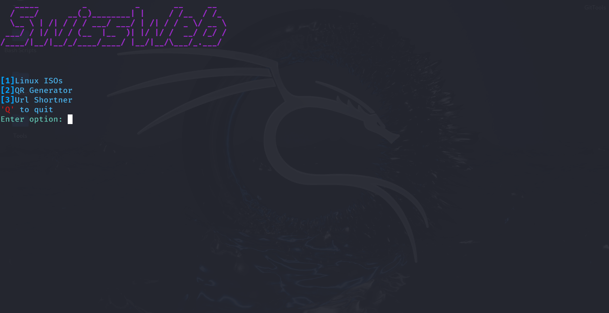
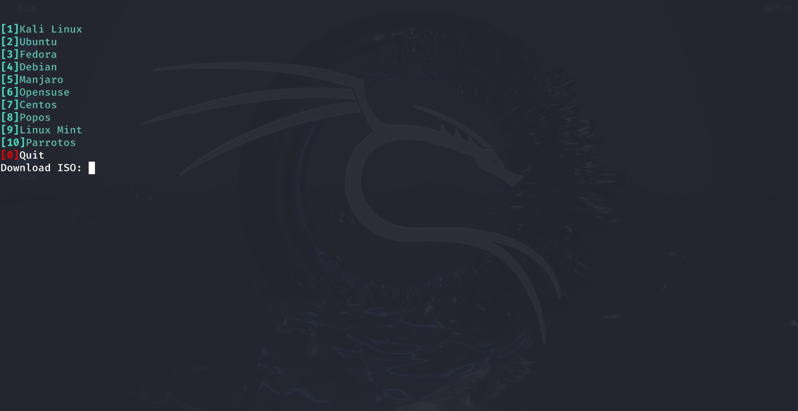

Download Linux distros straight from your terminal 

Install Dependencies
> pip install -r requirements.txt 

For manul dependency installation
> pip install tqdm==4.67.1 pyshorteners==1.0.1 qrcode==8.2 Requests==2.32.5 rich==14.2.0 pyfiglet==1.0.4  pillow==12.0.0

Run the tool
> python SwissWeb.py or python3 SwissWeb.py
